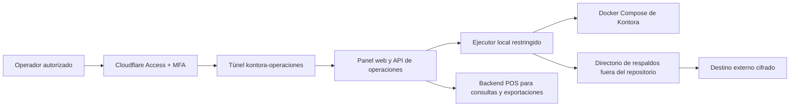

# Panel web de operaciones de Kontora

## Estado

Diseño aprobado técnicamente para implementación por fases. El panel todavía no
está habilitado y ninguna operación destructiva debe exponerse hasta completar
las fases de diagnóstico, respaldo y restauración.

## Objetivo

Crear una herramienta web independiente para:

- consultar la salud de PostgreSQL, Storage, backend, frontend y túneles;
- crear una pareja coordinada de respaldo de PostgreSQL y Storage;
- verificarla, cifrarla y copiarla a un destino externo;
- exportar información operativa a PDF y XLSX;
- consultar y eliminar de forma controlada archivos de evidencia;
- ejecutar un reinicio total solamente después de superar todas las
  precondiciones de seguridad;
- conservar una bitácora separada aunque la base principal sea detenida o
  reiniciada.

El panel debe funcionar en desarrollo local y quedar preparado para producción
después de clonar el repositorio y configurar solamente credenciales y destinos.

## Resultado del análisis de viabilidad

La herramienta es viable, pero no debe ser una pantalla que ejecute comandos
libres ni un contenedor con acceso directo a `/var/run/docker.sock`.

Kontora ya cuenta con:

- dos archivos Compose reproducibles para local y producción;
- volúmenes separados para PostgreSQL y Storage;
- migraciones Flyway como única fuente del esquema;
- consultas de ventas, cierre, gastos, inventario, depósito, transferencias y
  auditoría reutilizables para exportaciones;
- auditoría de acciones sensibles;
- un bucket privado y referencias de evidencia separadas de los binarios.

Todavía faltan:

- un cliente de eliminación para Storage;
- un ciclo de vida de evidencia que distinga activa, pendiente, eliminada y
  error;
- endpoints PDF/XLSX;
- automatización de respaldos con manifiesto y restauración aislada;
- una bitácora operacional independiente de la base que puede reiniciarse;
- el servicio ejecutor restringido que controle Docker desde el host.

## Dominio y Cloudflare

No se necesita comprar otro dominio. El dominio existente permite publicar un
subdominio, por ejemplo:

```text
operaciones.kontora-pos.store
```

La recomendación es crear un túnel nombrado independiente, por ejemplo
`kontora-operaciones`. Técnicamente un mismo túnel puede enrutar varios
hostnames, pero separar el túnel operativo reduce el alcance de una credencial,
permite detener el POS sin perder el panel y simplifica la auditoría.

El hostname operativo debe estar protegido con Cloudflare Access:

- permitir únicamente identidades explícitas;
- exigir MFA;
- usar sesiones cortas;
- no crear políticas `Everyone` ni `Bypass`;
- validar en el backend del panel el JWT emitido por Access, no solo confiar en
  que la página pasó por el túnel.

Referencias:

- [Rutas DNS de Cloudflare Tunnel](https://developers.cloudflare.com/cloudflare-one/networks/connectors/cloudflare-tunnel/routing-to-tunnel/dns/)
- [Términos y componentes de Tunnel](https://developers.cloudflare.com/cloudflare-one/networks/connectors/cloudflare-tunnel/get-started/tunnel-useful-terms/)
- [Seguridad de Docker Engine](https://docs.docker.com/engine/security/)

## Arquitectura objetivo



### Plano de operaciones

Debe vivir en un proyecto Compose independiente del POS. De esa forma el panel
permanece disponible mientras backend, frontend, Storage o PostgreSQL están
detenidos.

El estado de trabajos y su auditoría se guardan fuera de la base principal, en
un volumen propio del panel. El reinicio de Kontora no puede borrar esa
bitácora.

### Ejecutor local

El proceso con permisos sobre Docker debe ejecutarse en el host con un usuario
dedicado. La API web solo puede solicitar acciones incluidas en una lista
cerrada:

```text
health.snapshot
backup.create
backup.verify
backup.copy_external
restore.verify_isolated
evidence.delete
reset.preflight
reset.execute
```

No se aceptan comandos, rutas, nombres de volumen, archivos Compose ni
argumentos arbitrarios enviados por el navegador. Los nombres y rutas permitidos
se definen durante la instalación.

En producción, la comunicación entre la API y el ejecutor debe usar un socket
Unix dedicado o un canal local autenticado. En desarrollo Windows puede usar
`127.0.0.1` con una credencial generada y sin publicar el puerto en la red.

## Tres funciones diferentes

### 1. Respaldo restaurable

Un respaldo completo es una pareja inseparable:

```text
kontora_pos.dump
kontora_storage.tar.gz
manifest.json
manifest.sha256
```

El flujo coordinado es:

1. bloquear nuevos trabajos destructivos;
2. detener túnel del POS, frontend, backend y Storage para impedir escrituras;
3. generar un `pg_dump` de los esquemas `public` y `storage`, sin propietarios
   ni ACL;
4. detener PostgreSQL;
5. archivar el volumen de Storage con GNU tar, `--xattrs` y
   `--xattrs-include=user.supabase.*`;
6. calcular SHA-256 de ambos archivos;
7. crear el manifiesto;
8. reiniciar los servicios que estaban activos;
9. copiar la pareja cifrada al destino externo;
10. verificar periódicamente la restauración en recursos aislados.

El manifiesto debe incluir como mínimo:

- identificador y fechas del trabajo;
- entorno y versión del repositorio;
- imágenes y archivos Compose usados;
- nombres exactos de los volúmenes;
- bucket, límite y tipos permitidos;
- conteo de objetos y de referencias de evidencia;
- versiones exitosas de Flyway;
- tamaño y SHA-256 de cada archivo;
- resultado de copia externa;
- resultado y fecha de la última restauración aislada.

Listar el dump o el tar solo detecta corrupción estructural básica. Un respaldo
se considera restaurable cuando la pareja se restaura en recursos aislados, los
servicios quedan sanos y se descarga una evidencia conocida con el hash
esperado.

### 2. Exportación para análisis

Los archivos PDF y XLSX son reportes de negocio; no reemplazan un respaldo.

La primera versión debe exportar:

- ventas por periodo, con totales y métodos de pago;
- cierre de caja;
- gastos;
- inventario actual;
- movimientos de inventario;
- ventas de vasos;
- movimientos del depósito;
- transferencias;
- auditoría, exclusivamente para gerente.

La generación debe ocurrir en el backend para aplicar las mismas reglas de
autorización y registrar la exportación. El navegador solo selecciona filtros,
formato y descarga el resultado.

Cada XLSX debe contener una hoja de resumen, una hoja de datos y filtros
utilizados. Cada PDF debe mostrar periodo, fecha de generación, usuario,
totales y paginación. Los valores monetarios se mantienen numéricos en XLSX y
con formato COP en la presentación.

### 3. Copia externa

La copia externa protege contra pérdida del equipo o VPS. La implementación
debe ofrecer:

- destino de sistema de archivos para desarrollo;
- adaptador S3 compatible para producción;
- cifrado antes de salir del servidor;
- verificación posterior a la carga;
- política de retención configurable;
- credenciales de escritura separadas de las credenciales de restauración,
  cuando el proveedor lo permita.

El repositorio Git nunca es un destino de respaldos ni de exportaciones con
datos reales.

## Eliminación segura de evidencias

La evidencia está relacionada con un pago de venta, gasto de caja, consignación
bancaria o pago de servicio. El panel nunca debe eliminar esos registros
financieros.

La primera versión será manual y reservada al rol `gerente`. No se habilitará
eliminación automática por antigüedad hasta definir una política administrativa
y legal.

Flujo obligatorio:

1. filtrar por fecha, tipo, relación y tamaño;
2. mostrar una vista previa con número de archivos y espacio recuperable;
3. exigir motivo;
4. asociar un respaldo verificado que contenga los archivos;
5. presentar un reto de confirmación de corta duración;
6. marcar los registros como pendientes;
7. eliminar los objetos mediante una operación idempotente de Storage;
8. conservar la fila como tombstone, sin borrar la venta, gasto, consignación o
   pago asociado;
9. registrar usuario, IP, fecha, motivo, resultado y respaldo asociado;
10. permitir reintentar únicamente los elementos con error.

Para soportar este flujo se requiere una migración Flyway nueva. No se debe
editar `V1__schema_inicial_kontora_pos.sql`. La migración añadirá el ciclo de
vida, fechas, usuario, motivo, hash y referencia de respaldo necesarios.

## Seguridad obligatoria

- Cloudflare Access y MFA en producción.
- Autorización de gerente validada en el servidor para acciones destructivas.
- Protección CSRF para acciones autenticadas mediante navegador.
- Confirmación de dos pasos y reto de corta duración.
- Idempotencia para impedir ejecuciones duplicadas.
- Un solo trabajo destructivo a la vez.
- Bloqueo de nuevos inicios mientras existe un trabajo activo.
- Rutas y volúmenes fijados por configuración del servidor.
- Secretos redactados en interfaz, logs, manifiestos y mensajes de error.
- Sin consola web, terminal, editor de `.env` ni ejecución de comandos libres.
- Sin montaje directo del socket Docker en el panel.
- Copias y auditoría fuera del repositorio y fuera de la base reiniciable.
- El panel no puede eliminar su propio volumen ni el último respaldo verificado.

## Reinicio total desde el panel

El botón de reinicio permanecerá deshabilitado hasta que:

- no exista otro trabajo en curso;
- el operador sea gerente y supere la doble confirmación;
- se haya creado y copiado un respaldo verificado;
- los hashes locales y externos coincidan;
- estén definidos el usuario y la credencial temporal del gerente inicial;
- los nuevos nombres de volumen sean válidos y no colisionen;
- el panel continúe disponible sin depender del stack que será detenido.

La ejecución debe seguir exactamente la guía de
[reinicio total](../reinicio-total-datos/README.md), crear recursos nuevos,
validar Flyway, bucket, gerente, salud local y salud pública, y dejar los
volúmenes anteriores disponibles para reversión. Su eliminación definitiva debe
ser un trabajo posterior y separado.

## Configuración mínima después de clonar

Los secretos internos deben generarse mediante scripts del repositorio. El
operador solo debería suministrar:

```env
OPS_PUBLIC_HOSTNAME=operaciones.kontora-pos.store
OPS_CLOUDFLARE_TUNNEL_TOKEN=
OPS_CF_ACCESS_TEAM_DOMAIN=
OPS_CF_ACCESS_AUD=
OPS_ALLOWED_EMAILS=

OPS_EXTERNAL_BACKUP_PROVIDER=filesystem
OPS_EXTERNAL_BACKUP_PATH=

# Solo al seleccionar un destino S3 compatible:
OPS_S3_ENDPOINT=
OPS_S3_REGION=
OPS_S3_BUCKET=
OPS_S3_ACCESS_KEY_ID=
OPS_S3_SECRET_ACCESS_KEY=
```

En desarrollo:

- el panel escucha únicamente en `127.0.0.1`;
- el destino inicial es una carpeta fuera del repositorio;
- la autenticación local usa una credencial generada;
- el túnel operativo es opcional.

En producción:

- `OPS_EXTERNAL_BACKUP_PROVIDER` no puede ser `filesystem` como único destino;
- Access es obligatorio;
- el túnel operativo es independiente;
- la copia externa y su verificación son obligatorias antes de un reinicio.

## Fases y criterios de cierre

### Fase 0. Diseño y endurecimiento documental

- cerrar el reinicio actual;
- corregir arranques Compose para usar `--no-deps`;
- corregir respaldos para conservar atributos extendidos;
- definir límites, amenazas y decisiones pendientes.

Cierre: documentación validada sin enlaces rotos y sin operaciones destructivas
expuestas.

### Fase 1. Diagnóstico de solo lectura

- panel y túnel independientes;
- Access en producción;
- salud, versiones, volúmenes, espacio, Flyway, bucket y conteos;
- bitácora operacional independiente.

Cierre: el panel sigue mostrando el trabajo cuando el POS está detenido y no
posee endpoints mutables.

### Fase 2. Respaldo y restauración

- crear pareja coordinada;
- manifiesto y hashes;
- cifrado y copia externa;
- restauración aislada;
- descarga y hash de evidencia conocida.

Cierre: una copia generada por el panel se restaura completamente sin usar datos
del stack original.

### Fase 3. Exportaciones PDF y XLSX

- reutilizar las consultas existentes;
- aplicar permisos por reporte;
- registrar exportaciones;
- validar contenido y formato.

Cierre: PDF y XLSX coinciden con las consultas para un periodo controlado y no
contienen datos fuera del alcance del usuario.

### Fase 4. Ciclo de vida de evidencias

- migración Flyway;
- listado global para gerente;
- borrado individual y por lote;
- respaldo obligatorio, tombstone, auditoría y reintentos.

Cierre: se elimina el binario seleccionado, permanece la trazabilidad
financiera y una restauración desde el respaldo recupera la evidencia.

### Fase 5. Reinicio total protegido

- preflight;
- respaldo externo verificado;
- doble confirmación;
- ejecución por estados;
- validación integral;
- reversión;
- limpieza posterior separada.

Cierre: una prueba completa crea un entorno vacío, provisiona el gerente
inicial, valida acceso y conserva una reversión utilizable.

## Decisiones pendientes antes de implementar

1. Seleccionar el proveedor externo S3 compatible o indicar otro destino.
2. Definir quiénes tendrán acceso al hostname operativo.
3. Definir la política administrativa y legal de retención de evidencias.
4. Definir frecuencia y retención de respaldos.
5. Definir ventana de mantenimiento y tiempo máximo aceptable de interrupción.

Hasta resolver el punto 3, la eliminación será solamente manual y nunca
automática.
